# 🐾 ゴンニャン・プロンプトキット VOL.2

**曖昧なひと言を、そのまま生成に使える gpt-image-2 完成プロンプトへコンパイルする Claude Code スキル。**

<samp>[한국어](README.md) · [English](README.en.md) · **日本語**</samp>

[](LICENSE) &nbsp; &nbsp; &nbsp;


「ポスターを1枚作って」程度のリクエストを受け取り、そのまま生成に投入できる完成形の韓国語プロダクションプロンプトを組み立てる。上のキービジュアルも、このキットでコンパイルしたプロンプト（C11 シネマティック・キーアート）から生成したものだ。


ラフなリクエスト → 完成プロンプト → バリデーター通過。この3ステップがスキルの中で完結する。画像生成そのものはスコープ外 — 大量生成は [codex-fleet](https://github.com/kimsh-1/codex-fleet) の `codex-imagegen` スキルを、1枚だけなら `codex` に直接投入する。

> インタラクティブデモ：**[kimsh-1.github.io/gongnyang-prompt-kit](https://kimsh-1.github.io/gongnyang-prompt-kit)**

## 何が違うのか — v3 単一ルーティング表

v3 のコアはルーティング表ひとつだ。リクエストのシグナルを受けたら下の表から1行を選び、その行が指すリファレンスファイルを**1つだけ**読む。ルーティングの正本は [`skills/image-prompt/SKILL.md`](skills/image-prompt/SKILL.md) にある表の一箇所のみで、以下はその読者向けミラーである。

| こう頼むと | こうコンパイルされる | 読むリファレンス |
|---|---|---|
| 単独人物のグラビア・エディトリアル | C1 · Format B フラットカンマ形式 | [`editorial-hwabo.md`](skills/image-prompt/references/editorial-hwabo.md) |
| タイポポスター・「文字がそのまま絵になる」 | TP1〜TP14 からパターン1つ | [`typo-poster-router.md`](skills/image-prompt/references/typo-poster-router.md) → `typo-poster/` 1ファイル |
| 販促グラフィック・「デザインの効いたポスター」 | P1〜P8 からパターン1つ | [`promo-router.md`](skills/image-prompt/references/promo-router.md) → `promo/` 1ファイル |
| ポスター・キーアート・インフォグラフィック・カードニュース・漫画・図鑑・アイコン・ビューティー・キャンペーン・モックアップ | C2〜C11 | [`category-patterns.md`](skills/image-prompt/references/category-patterns.md) 該当セクション |
| プレゼンテーション・スライドデッキ | C12（16:9 がデフォルト） | [`category-patterns.md`](skills/image-prompt/references/category-patterns.md) §C12 |
| ムード（「高見えに」・「ラグジュアリーに」・「映画みたいに」） | ルックプリセット L1〜L9 ドロップイン | [`look-presets.md`](skills/image-prompt/references/look-presets.md) |
| 案のバリエーション出し・「コンセプトから固めて」 | コンセプト軸 M1〜M10 / R / X / T1〜T5 の変奏 | [`concept-axes.md`](skills/image-prompt/references/concept-axes.md) |
| 文字配置・フォント・グリッド・高密度テキスト | 領域文法・ロールラベル | [`typography-layout.md`](skills/image-prompt/references/typography-layout.md) |
| カメラ・照明・色の語彙 | 結果記述の語彙 | [`photo-vocab.md`](skills/image-prompt/references/photo-vocab.md) |
| jsonl バッチ・モデルファクト・完成例 | jsonl スキーマ・codex 骨格 | [`jsonl-and-examples.md`](skills/image-prompt/references/jsonl-and-examples.md) |

ライブラリのカバー範囲：カテゴリ **C1〜C12** · タイポポスター **TP1〜TP14** · 販促グラフィック **P1〜P8** · ルックプリセット **L1〜L9** · コンセプト軸 **M1〜M10 / R / X / T1〜T5**。

## 生成例 — プロンプトはこう変わる

同じ gpt-image-2 だ。**左は人間のひと言をそのまま投入した結果、右はそのひと言をキットがコンパイルして投入した結果** — 違いはプロンプトだけ。キットが出力するのは韓国語のプロダクションプロンプト（ハングルのレンダリング精度を第一に設計）のため、コンパイル済みプロンプトは生成時のままの韓国語で掲載する。コンパイル記録の全量は [`examples/showcase.jsonl`](examples/showcase.jsonl) にある。

#### `とにかくすごい画像を1枚` → C11 シネマティック・キーアート

| スキルなし | キットでコンパイル |
|---|---|
|  |  |

<details>
<summary>コンパイル済みプロンプト全文</summary>

```
시네마틱 키아트 — 새벽 구름바다 위로 도약하는 거대 고래.
Scene: 해 뜨기 직전의 구름 바다, 그 위로 거대한 혹등고래 한 마리가 구름 물보라를 흩뿌리며 도약하는 순간, 아래 절벽 끝에 작은 관측자 실루엣 한 명, 상단 하늘 밴드는 비워둔 클린 영역.
Camera: 초광각 vista, 로우 앵글, 인물 대비 압도적 스케일 대비, deep aerial perspective.
Lighting: 지평선의 골드 백라이트가 고래의 림을 태우고, 구름 틈으로 volumetric 광선이 쏟아진다.
Color grading: 새벽 인디고 #1B2440, 골드 #E8B168, 페일 로즈 #E8C4C4.
Texture/Medium: cinematic grain, 옅은 안개 드리프트.
AR 16:9
```

</details>

#### `ジャズバーのポスター` → C3 ハングルポスター

| スキルなし | キットでコンパイル |
|---|---|
|  |  |

<details>
<summary>コンパイル済みプロンプト全文</summary>

```
한국어 재즈바 포스터, 상업 인쇄 완성도.
Scene: 상단 1/3 타이틀 밴드, 중앙에 콘트라베이스 연주자의 딥블루 실루엣 일러스트와 담배연기 같은 얇은 곡선, 하단 캡션 밴드. 정돈된 매거진 여백.
Camera: 정면 평면 구성, 중앙 정렬, 풀블리드.
Lighting: 무대 스포트라이트 하나가 실루엣 뒤에서 번지는 글로우.
Color grading: 미드나잇 #101A2E, 크림 #F3EEE2, 브라스 골드 #C9A24B.
Texture/Medium: 매트 아트지, 미세 그레인, 인쇄 톤.
Text-in-image: headline "밤과 재즈" 상단 중앙(굵은 세리프, 크림), caption "매주 금·토" 하단 중앙(콘덴스드 산세리프, 골드).
All text appears once, perfectly legible — no duplicate text, no extra words, no invented glyphs, no watermark.
AR 4:5
```

</details>

#### カテゴリ（C1〜C10）

| リクエスト → パターン | スキルなし | キットでコンパイル |
|---|---|---|
| `エディトリアルを1枚` → C1 エディトリアル |  |  |
| `リップバームの広告カット` → C2 ビューティー |  |  |
| `イヤホンの図鑑` → C4 プロダクト図鑑 |  |  |
| `香水のキャンペーン` → C5 キャンペーン |  |  |
| `コーヒーのインフォグラフィック` → C6 インフォグラフィック |  | 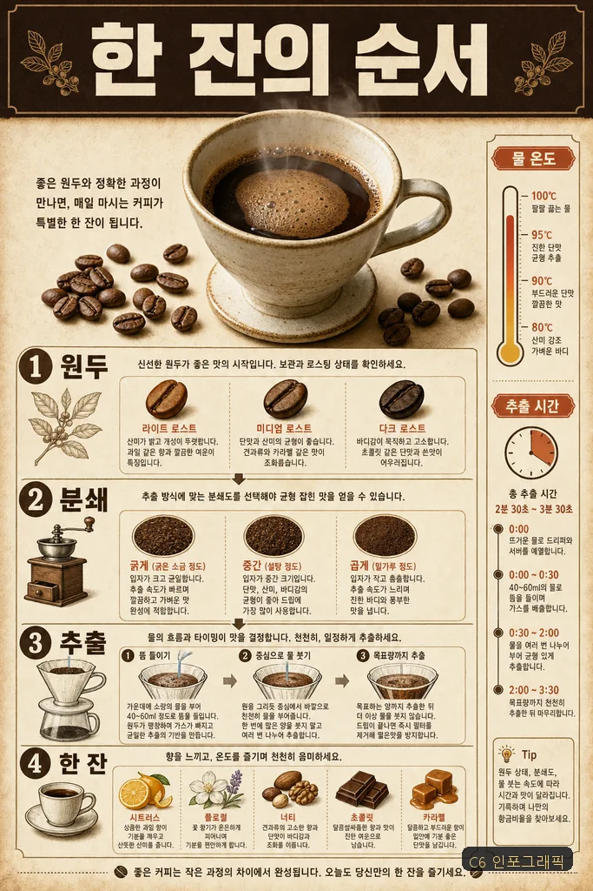 |
| `節約カードニュース` → C7 カードニュース |  |  |
| `グラノーラのパッケージ` → C8 ブランディング |  |  |
| `ロケットの3Dアイコン` → C9 3Dアイコン |  |  |
| `猫の4コマ漫画` → C10 漫画 |  |  |
| `SFキーアート` → C11 キーアート |  |  |

#### ルックプリセット（L1〜L9）

| リクエスト → ルック | スキルなし | キットでコンパイル |
|---|---|---|
| `ラグジュアリーな腕時計` → L1 ラグジュアリー・エディトリアル |  |  |
| `ダッシュボードのヒーロー画像` → L5 ダークテック |  |  |
| `年末の招待状` → L8 ゴールドフォイル |  |  |

#### コンセプト軸（M・T）

| リクエスト → 軸 | スキルなし | キットでコンパイル |
|---|---|---|
| `波のタイポグラフィポスター` → T1 動きの翻訳 | 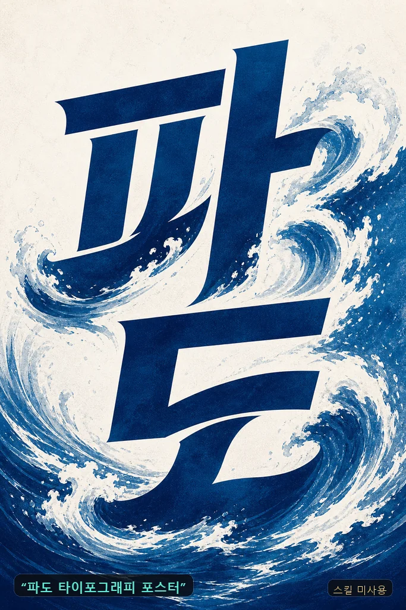 | 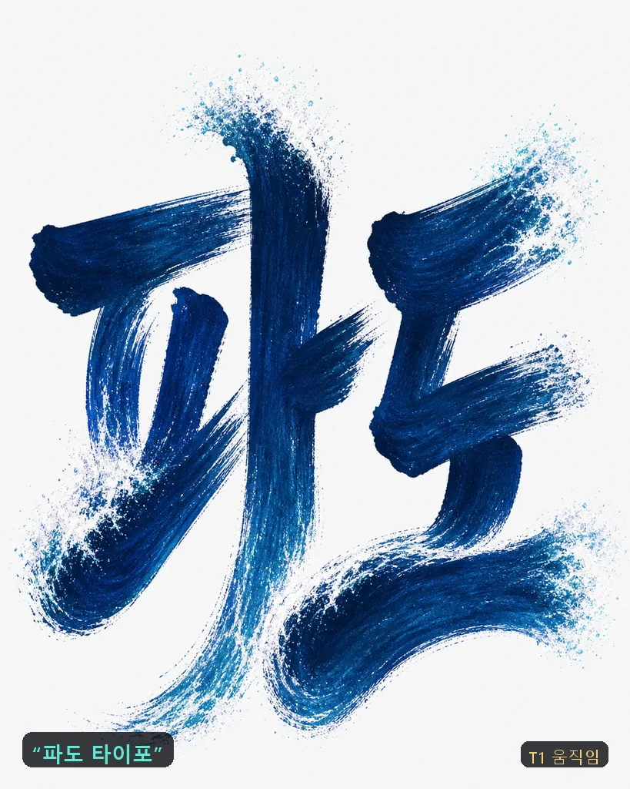 |
| `ナイトマーケットのポスター、ヒップでキッチュに` → T3 意図的歪曲 | 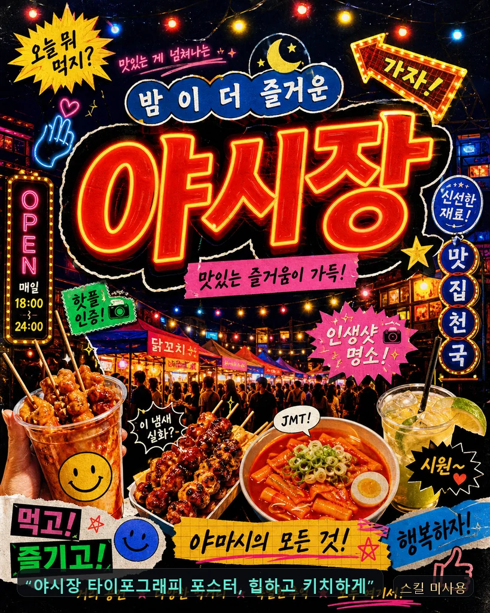 | 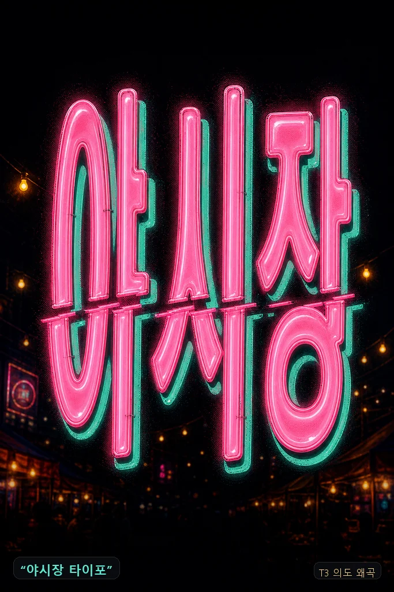 |
| `ウイスキーの広告ポスターを高級感たっぷりに` → M2 アール・デコ |  |  |
| `ロックフェスのポスターをかっこよく` → M8 構成主義 |  |  |
| `アロマキャンドルブランドのポスターをきれいに` → M7 アール・ヌーヴォー |  |  |
| `エレクトロニックパーティーのポスターをヒップに` → M9 サイケデリック |  |  |

## タイポグラフィポスター（TP1〜TP14）— 文字がそのまま絵になる

文字の内側に風景をマスキングし（TP1）、単語をトンネル状に無限反復して空間を生み（TP2）、文字を建築物として積み上げ（TP3）、影と反射が文字を書き（TP4）、ガラス・クロム・バルーンの実物として彫り出し（TP7〜TP9）、分割塗装がただひとつの視点から単語へ合体し（TP13）、数千個の微細な文字が肖像を描く（TP14）。パターン定義は [`typo-poster-router.md`](skills/image-prompt/references/typo-poster-router.md)、全カットのコンパイル記録は [`examples/typo-poster.jsonl`](examples/typo-poster.jsonl)。

| TP1 · フォトマスキング（SEOUL） | TP2 · テキストトンネル（무한） | TP3 · タイプ建築（BUILD·WERK） |
|---|---|---|
|  |  |  |
| **TP4 · 光学現象（쉼）** | **TP5 · 物性破壊（해체）** | **TP6 · スイスキネティック（will kern for food）** |
|  |  |  |
| **TP7 · 材質彫刻（얼음）** | **TP8 · リキッドクローム（녹아）** | **TP9 · インフレータブル（몰랑）** |
|  |  |  |
| **TP10 · オプアートパターン（진동）** | **TP11 · アシッドグラフィックス（광란）** | **TP12 · フューチャーメディーバル（심판）** |
|  |  |  |
| **TP13 · アナモルフィック錯視（LOOK）** | **TP14 · ミクログラフィー（고요）** | |
|  |  | |

ハングルのヒーローワードが、ほとんどのパターンでそのまま成立する — クロムドリップの「녹아（溶ける）」、バルーンの「몰랑（ぷにぷに）」、オプアートの「진동（振動）」、影の「쉼（憩い）」、微細文字の肖像「고요（静寂）」まで。

## 販促グラフィック（P1〜P8）— デザイナーズポスターの文法

カードニュースの美感ではなく、デザイナーが作った販促物のトーンで仕上げるレイヤー。タイポが装飾ではなく被写体と物理的に絡み合う8つのレイアウト文法 + 2〜3色のハードロック + 印刷仕上げのデバイス。ルックプリセット（L）と直交し、相互に掛け合わせられる。パターン定義は [`promo-router.md`](skills/image-prompt/references/promo-router.md)。

| P1 タイポマスク · 文字の中の写真 | P2 タイポ環境 · アイソメトリック地形 | P3 オーバーサイズクロップ + オクルージョン |
|---|---|---|
|  |  | 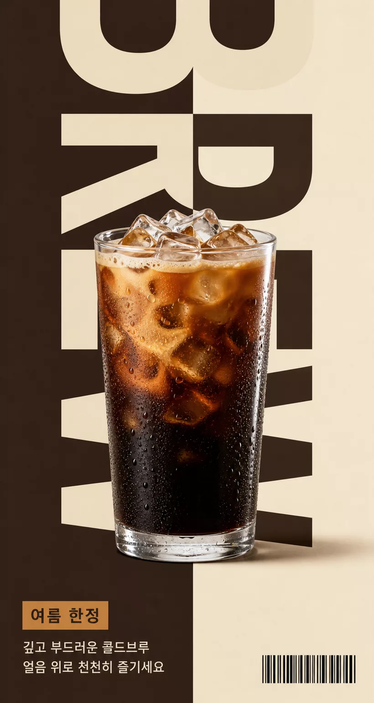 |
| **P5 メタUI · セレクションボックス** | **P6 ストリートコラージュ** | **P8 モノクロームステージング** |
|  | 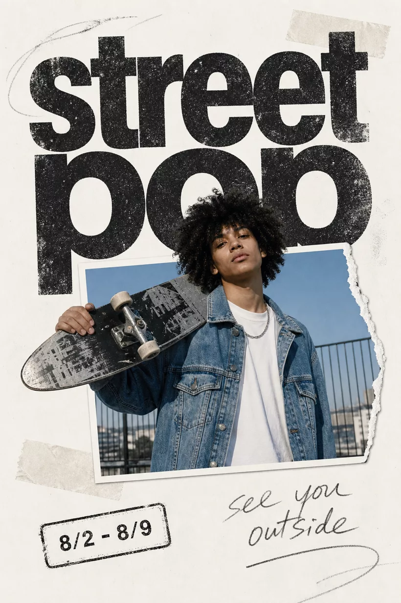 | 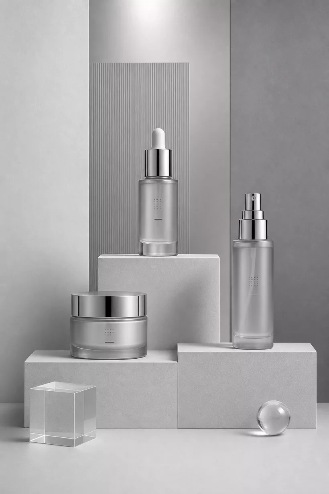 |
| **オクルージョン × 影の叙事 · 「집（家）」** | **マスキング × タイポ環境 · 「폭풍（嵐）」** | **光柱 × ステージング · 「고요（静寂）」** |
| 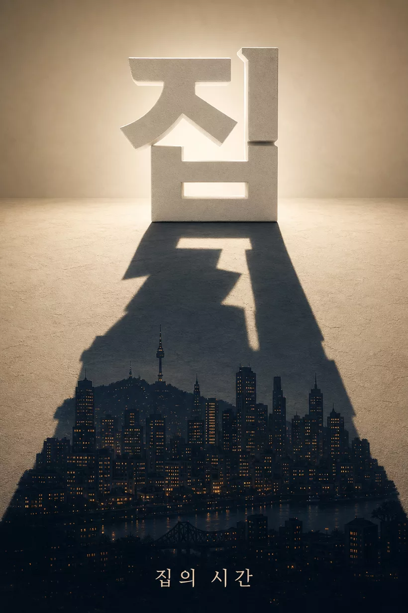 | 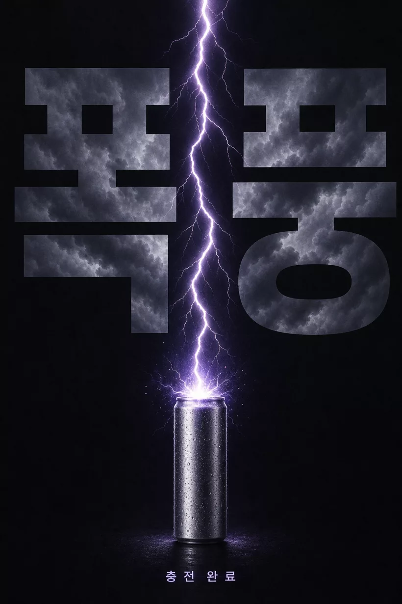 | 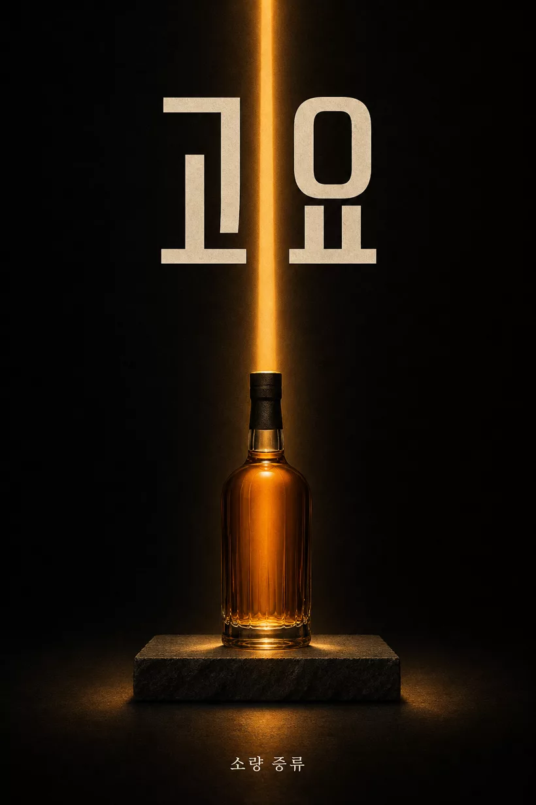 |
| **マスキング × セレクション · 「소리（音）」** | **回転軸 × マスキング · 「바다（海）」** | **文字=本棚 · 「책방（本屋）」** |
| 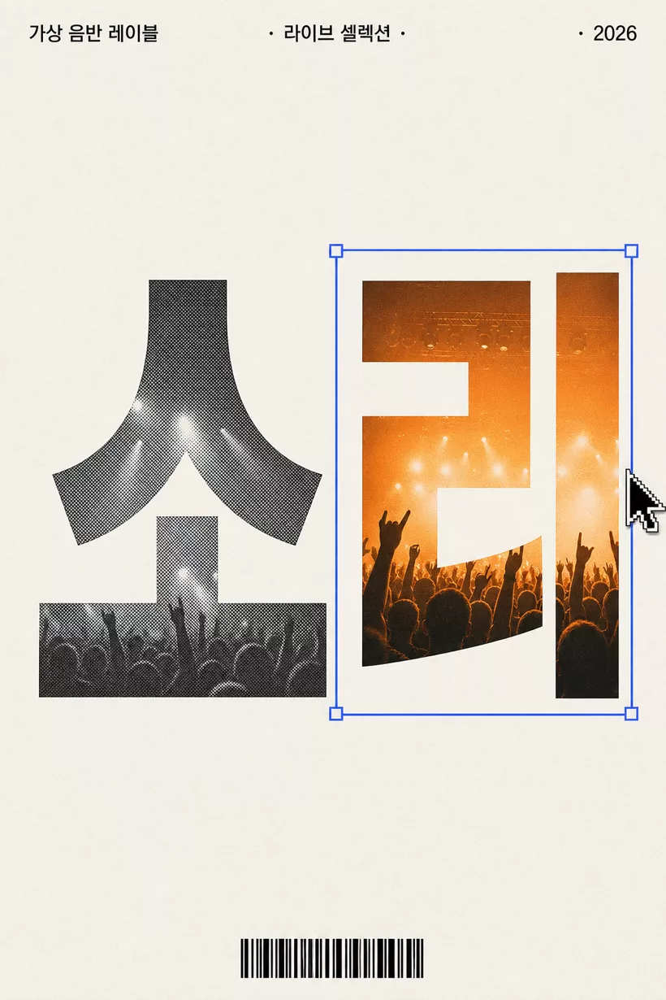 | 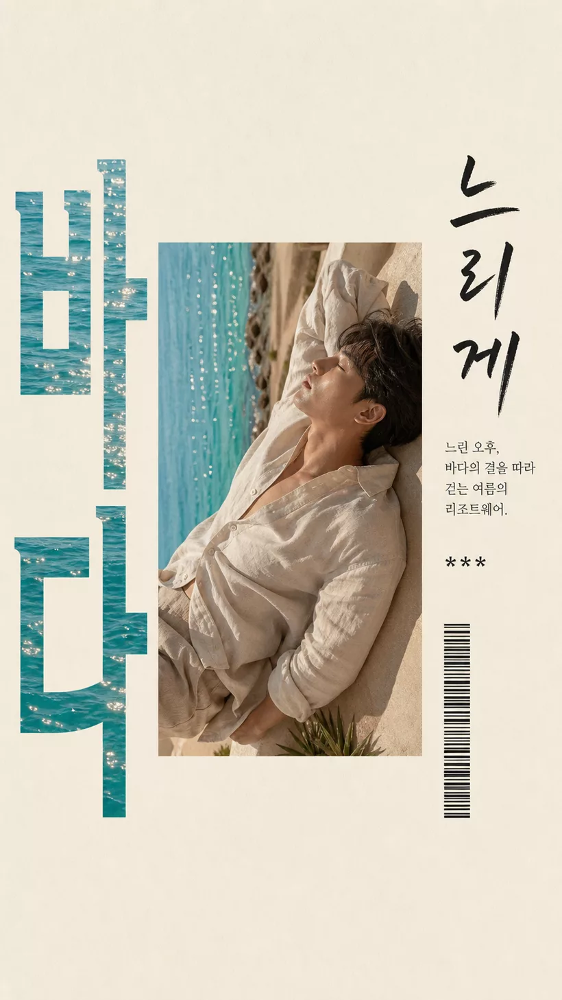 |  |

下段の6カットは、パターンを2〜3個掛け合わせてハングルの見出しで立てたクロスブリードセットだ。ハングル見出しは、マスキング・押し出しのいずれも2文字が安全圏。

## ホンデ（弘大）インディーズ・ムードライン（L9）

「それっぽく高見えする」感性を8つの生成エンジンに分解したルックプリセット L9 — 単語世界タイポ（A）、美術思潮の再解釈（B）、コラージュ（C）、フィルム写真（D）、Riso ジン（E）、ミックスメディア（F）、静物（G）、そしてオブジェの影がシネマティックな場面へ滲み出す影の叙事（H）。

| H · 影の叙事（フィルムカメラ） | A · 単語世界（새벽＝夜明け） | D · フィルム（밤＝夜） |
|---|---|---|
|  |  |  |
| **B · 思潮（サイケデリック）** | **E · Riso ジン（ポスター）** | **C · コラージュ（メンフィス）** |
|  |  |  |
| **G · 静物（侘び寂び）** | **F · ミックスメディア（顔のモンタージュ）** | **D · フィルム（屋台）** |
|  |  |  |
| **H · 影の叙事（ウイスキーグラス）** | **A · 単語世界（여름밤＝夏の夜）** | **D · フィルム（地下クラブ）** |
|  |  |  |

## プレゼンデッキ・複雑図解（C6·C12）

プレゼンスライドや複雑な概念説明の図解も、同じキットでコンパイルする — シーケンス図、多対多ネットワーク、フィードバックループ、スライドあたりハングル400〜800字をレンダリングする高密度テキストまで。

| 超高密度テキスト（Transformer、約700字） | キャッシュ戦略5種の比較表（約700字） |
|---|---|
|  |  |
| **TCP シーケンス図（ライフライン・交差メッセージ）** | **21:9 データスライド（目盛り・値ラベル）** |
|  |  |

全40カットのギャラリーと元プロンプトの jsonl は [`examples/diagram-gallery/`](examples/diagram-gallery/)。要点は3つ — テキスト精度の第一のレバーはキャンバスの縦の高さ（16:9・2:3 で700〜800字が安定）、クリティカルなラベルだけを引用符で固定して本文の密度は自由記述ゾーンに委ねる、図解はノード・接続・方向を文章で具体的に指定すれば正面突破できる。

## コアルールのハイライト

うまく出すためのルールではなく、出なくしてしまう癖を封じるルールだ。全文は [`skills/image-prompt/SKILL.md`](skills/image-prompt/SKILL.md) の §철칙（鉄則）にある。

| ルール | 要旨 |
|---|---|
| **ティアードネガティブ** | gpt-image-2 はシーンネガティブ（"no crowd"）を、むしろその単語どおりに描いてしまう。シーンの排除はすべて肯定形での言い換え（Tier-0）が基本。例外は2レーンのみ — Tier-1 テキストレンダーガード（ホワイトリスト7種、レンダーテキストがあるときだけ）、Tier-2 エディトリアル・コンプライアンスペア（明示宣言時のみ、正本は `editorial-hwabo.md` §3 の一箇所）。ホワイトリスト外の否定文はバリデーターがすべて検出する。 |
| **SD 時代の廃止語彙の禁止** | `masterpiece / 8k / trending on artstation`、重み付け `(word:1.3)`、`--ar` フラグも、「きれいに・高級感を・受賞級に」のような空疎な形容詞も、すべてノイズだ。数値・身体反応・具体例に還元する。 |
| **サイズロック** | codex（`$imagegen`）経路で安全なのは6種のみ — 1:1 `1024x1024` · 2:3/3:4/4:5 `1024x1536` · 3:2/4:3 `1536x1024` · 16:9 `1792x1024` · 9:16 `1024x1792` · 高密度/マルチカット `2048x2048`。`auto` 禁止、プロンプト冒頭の `[AR ...]` ブラケット禁止、末尾に `AR x:y` トークンを1つだけ置く。 |
| **文字の後処理は絶対禁止** | テキストはプロンプトで画像の中にレンダリングする（引用符コピー + ロールラベル + 自由記述ゾーン）。生成済み PNG の上にコードで文字を合成（PIL・ImageMagick・SVG）すると、フォント・カーニング・トーンが浮く。文字の誤りはプロンプト修正 → 再生成でのみ直す。 |
| **機材スペック → 結果記述** | モデルは `Canon R5 f/1.4` を知らない。"shallow DoF, background falls off softly" のように結果で書く。 |
| **数値を打ち込む** | HEX パレット（カットあたり3〜5色）、ケルビン、`key:fill 1:2`。 |
| **1行 = 1カット = 1コール** | 1枚のキャンバスに複数カットをグリッドで描かない。複数カットは N 行に分ける。 |

## インストールと使い方

```bash
git clone https://github.com/kimsh-1/gongnyang-prompt-kit
ln -s "$PWD/gongnyang-prompt-kit/skills/image-prompt" ~/.claude/skills/image-prompt
```

Claude Code で「画像プロンプトを書いて」「エディトリアルのプロンプト」「キーアート」「タイポポスター」などのトリガー、または `/image-prompt` で実行する。シンボリックリンクで導入すればリポジトリの更新が自動反映される。バリデーターの実行には Node.js が必要。

書き上げたプロンプトはバリデーターで検査する。ティアを認識し、ホワイトリスト外のネガティブだけを検出する。

```bash
node skills/image-prompt/scripts/check_prompt.mjs examples/poster.txt        # テキストモード
node skills/image-prompt/scripts/check_prompt.mjs --tier 2 examples/hwabo_formatB.txt
node skills/image-prompt/scripts/check_prompt.mjs --jsonl examples/prompts.sample.jsonl
node skills/image-prompt/scripts/check_prompt.mjs --test                     # 回帰セルフテスト
```

`{ok, format, tier, errors, warnings}` の JSON を返す。ホワイトリスト外のネガティブ・冒頭ブラケット・SD 廃止語彙・サイズロック違反・スロットトークンの残存は `error`（肯定形への rewrite ヒント付き）、空疎な形容詞・HEX 欠落などは `warning`。通過・失敗のサンプルは [`examples/`](examples/) にある。

生成まで繋ぐには [Codex CLI](https://github.com/openai/codex) のログイン + ChatGPT Plus/Pro が必要だ。

## v3.0.0 — 何を変え、どう検証したか

v3 はルールの追加ではなく、構造のリファクタリングだ。スキル本文を圧縮し、ルーティングを一箇所に集約した。

**リファクタリング実測**

- SKILL.md 本文 17.6KB → 9.5KB
- ルーティング3箇所の重複 → 単一ルーティング表10行（ルーティングの正本は SKILL.md の表一箇所）
- frontmatter description 940字 → 316字
- Tier-2 凍結文言の全文正本を `editorial-hwabo.md` §3 の一箇所に単一化
- [`RELEASING.md`](RELEASING.md) リリースチェックリストを新設

**検証実測**

- `check_prompt.mjs` fixtures **16/16 PASS**
- fresh-context ルーティングクイズ **8/8**（スキルを初見のコンテキストが、ルーティング表だけで正答に到達）
- ルール欠落監査 **0件** — v2 の規範ルールが全数保存されていることを確認

**50カット実戦テスト（2026-07-20）**

新しい SKILL.md だけを読んだエージェント10機が、C1〜C12・TP1〜TP14・P1〜P8・ルック/コンセプト軸にまたがる50カットをコンパイルした。

| 段階 | 結果 |
|---|---|
| バリデーター通過 | 50/50 |
| codex（`$imagegen`）実生成 | 50/50 成功 |
| モデレーション拒否 | 0 |
| 所要時間 | 13.5分（オートスケーリング、ピークワーカー13） |

## 構成


ラフなリクエストがスキルコアとリファレンスを経て完成プロンプトになり、バリデーターを通過して初めて生成へ進む。SKILL.md には常時ロードされるコアだけを置き、深いディテールは `references/` に分離した（progressive disclosure）。

```
skills/image-prompt/
├─ SKILL.md                      # コア — ワークフロー・単一ルーティング表・鉄則・フォーマット A/B・サイズロック・バリデーター
├─ references/                   # ルーティング表が指すときだけ読む深層コンテンツ
│  ├─ category-patterns.md       #   C1〜C12 カットタイプ・デフォルト AR・漫画・キーアート・デッキ
│  ├─ look-presets.md            #   ルックプリセット L1〜L9 ドロップイン
│  ├─ promo-router.md            #   販促グラフィックルーター（P1〜P8）・仕上げデバイス・クロスブリード
│  ├─ promo/                     #     P1〜P8 パターン別ドロップイン（ルーターが選んだ1つだけロード）
│  ├─ typo-poster-router.md      #   タイポポスタールーター（TP1〜TP14）
│  ├─ typo-poster/               #     TP1〜TP14 パターン別ドロップイン（ルーターが選んだ1つだけロード）
│  ├─ concept-axes.md            #   コンセプト軸 — 思潮 M1〜M10・身体反応の翻訳・矛盾ペア・色翻訳・タイポアート T1〜T5
│  ├─ typography-layout.md       #   領域文法・ロールラベル・フォント語彙・グリッド
│  ├─ editorial-hwabo.md         #   エディトリアル Format B・スロット12種・Tier-2 正本（§3）
│  ├─ jsonl-and-examples.md      #   jsonl スキーマ・モデルファクト・codex 呼び出し骨格
│  ├─ photo-vocab.md             #   カメラ・照明・フィルム・構図・色の語彙 + 韓英混用
│  └─ style-taxonomy.md          #   ファッション21種 + persona DNA
└─ scripts/
   ├─ check_prompt.mjs           # ティア認識バリデーター（--jsonl/--tier/--api/--test）
   └─ fixtures/                  # 回帰テスト用フィクスチャ
```

## リリース・ライセンス

パターン群の追加やルール変更時の6段階チェックリストは [`RELEASING.md`](RELEASING.md) にある — バージョン・description・ルーティング表・README 3種・インストール版・バリデーターを揃って更新しなければリリースできない。

ライセンスは [MIT](LICENSE)。
